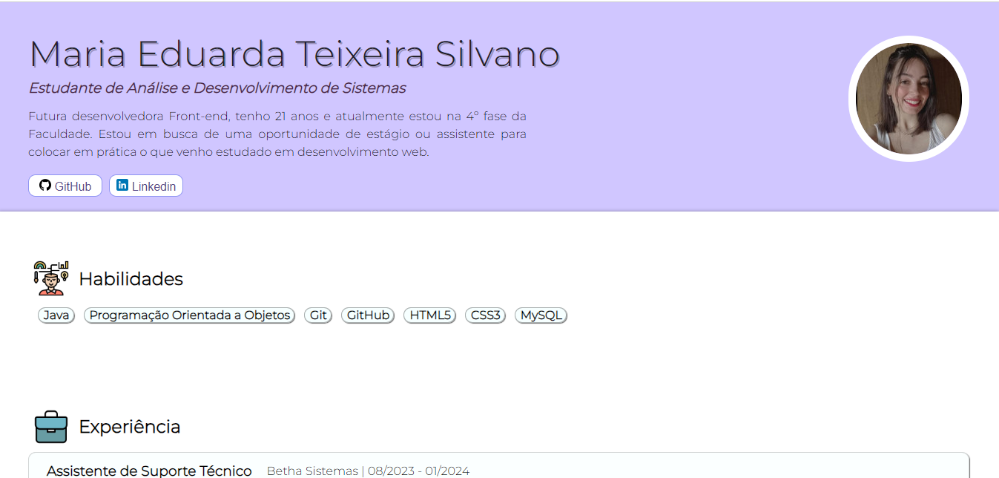

<h1 align="center"> Portfólio </h1>

Projeto desenvolvido com o intuito de praticar o aprendizado adquirido em HTML5 e CSS3.  

  <a href src="#tecnologias">Tecnologias</a>;
  <a href="#-projeto">Projeto</a>;

 

  

## 🚀Tecnologias

Esse projeto foi desenvolvido com as seguintes tecnologias:

-> HTML e CSS
 
-> Git e Github

## 💻Projeto

- [Visite o projeto online](https://mariaeduardateixeira.github.io/projeto-cordel/)

